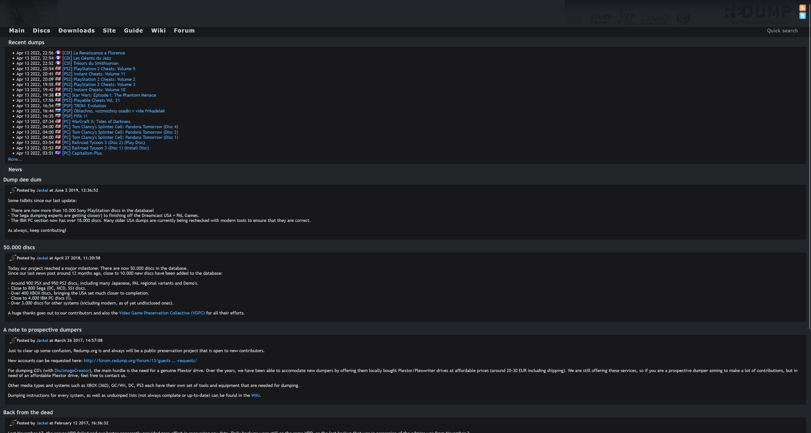
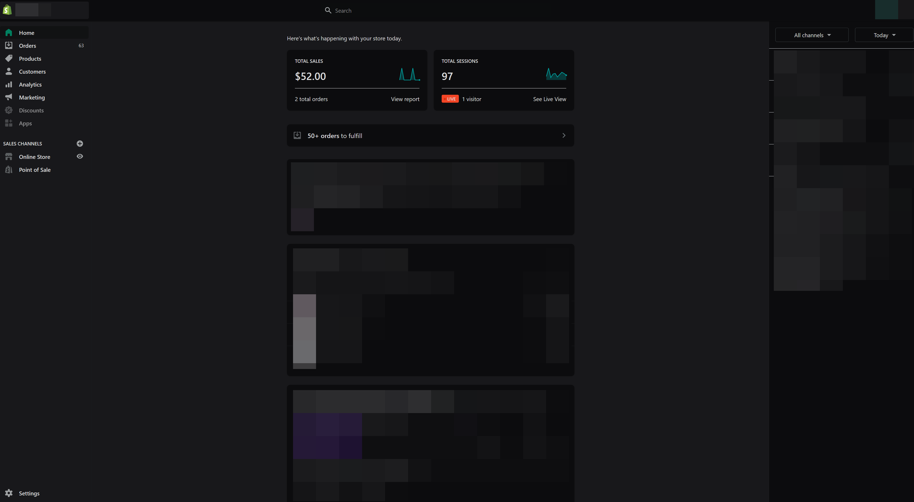
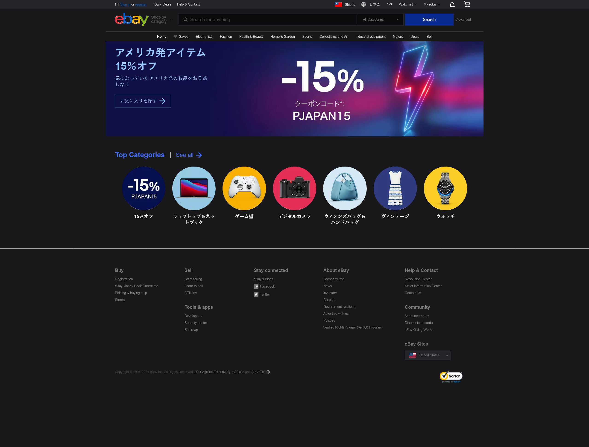
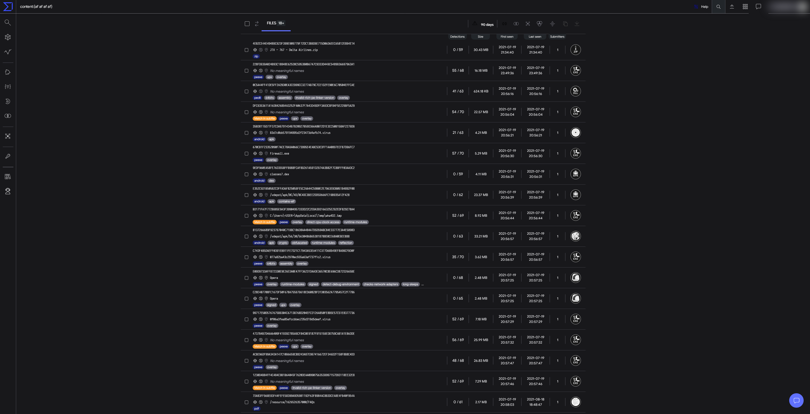

# AzuraStyles

## Supported Websites

### Redump (Dark)

> Fixes the Redump atrocious light mode design.

[Install](https://github.com/Still34/azura-styles/raw/master/styles/DarkRedump.user.css)

### Furuke (Dark)

> Furuke, but much less performance-intensive than Dark Reader.

[Install](https://github.com/Still34/azura-styles/raw/master/styles/DarkFuruke.user.css)

### Shopify (Dark)

> Inverts the official color palette, making the dashboard a little more bearable.

[Install](https://github.com/Still34/azura-styles/raw/master/styles/DarkShopify.user.css)

### eBay (Dark)

> Inverts the official color palette. eBay is lame and doesn't have a coherent class names, so I did the hard work for you.

[Install](https://github.com/Still34/azura-styles/raw/master/styles/DarkEbay.user.css)

### VirusTotal (Dark)

> VirusTotal, but less eyestraining. Remember to install 'Stylus Shadow DOM Support', otherwise some sections of the site will not render properly!

[Install](https://github.com/Still34/azura-styles/raw/master/styles/DarkVirusTotal.user.css)

### Pixiv (Dark)

> Fixes the incomplete dark mode implementation on Pixiv. This userstyle assumes you have the official dark mode enabled.

[Install](https://github.com/Still34/azura-styles/raw/master/styles/DarkPixiv.user.css)

## Author

👤 **Still Hsu**

- Website: <https://stillu.cc>
- Twitter: [@StillAzureH](https://twitter.com/StillAzureH)
- GitHub: [@Still34](https://github.com/Still34)

## Show your support

Give a ⭐️ if this project helped you!
